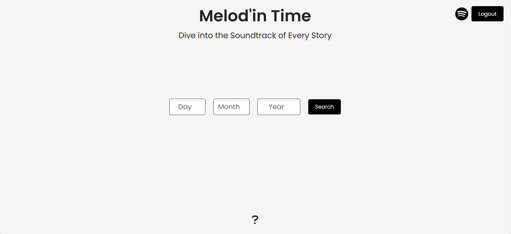
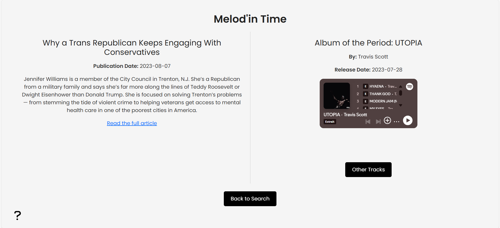
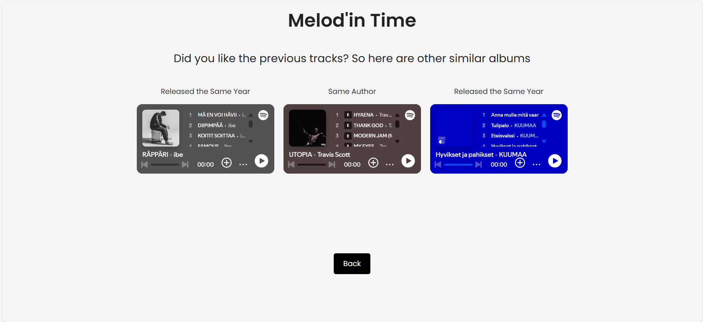

# Melod'in Time 🎵

WOHI Final Project

**Melod'in Time** is a web application that connects the world of journalism and music. By entering a specific date, users can discover:
- Articles published on that date from The New York Times.
- Albums or songs released around that time via Spotify.

The app provides an interactive and minimalist interface with features like music suggestions from the same artist or year, alongside seamless integration with Spotify.

---

## Table of Contents
1. [Features](#features)
2. [Technologies Used](#technologies-used)
3. [Project Structure](#project-structure)
4. [Setup and Installation](#setup-and-installation)
5. [How It Works](#how-it-works)
6. [Screenshots](#screenshots)


---

## Features

- **Search Articles**: Enter a date to retrieve the most relevant article from The New York Times.
- **Discover Music**: Explore songs or albums released on the same date or year from Spotify.
- **Responsive UI**: A fully responsive interface designed for desktops, tablets, and mobile devices.
- **Interactive Widgets**: Includes Spotify embeds to preview music and a help section for guidance.
- **Minimalist Design**: A clean, user-friendly interface.

---

## Technologies Used

### Frontend
- **React.js**: Core framework for the frontend.
- **React Router**: For navigation between pages.
- **React-Bootstrap**: Styling components like buttons and spinners.
- **CSS**: Custom styling for a minimalist and consistent design.

### Backend
- **Node.js**: Backend runtime for handling API requests.
- **Express.js**: Framework for routing and handling server logic.

### APIs
- **New York Times API**: Fetches articles based on the given date.
- **Spotify API**: Fetches albums or songs released on or near the specified date.

---

## Project Structure

```
melod-in-time/
├── src/                        # Source code
│   │                           # React components
│   ├── SearchPage.jsx          # Main page for searching articles
│   ├── ReadPage.jsx            # Displays selected article and related music
│   ├── OtherMusicPage.jsx      # Suggests other music tracks
│   ├── SearchBar.jsx           # Input form for date search
│   ├── App.jsx                 # Main application entry
│   ├── App.css                 # Main style file
│   └── main.jsx                # React DOM rendering
├── server.js                   # Node.js backend server
├── index.html                  # Main website entry
├── package.json                # Dependencies and scripts
└── README.md                   # Project documentation
```

---

## Setup and Installation

### Prerequisites
1. **Node.js** installed on your system.
2. **Spotify Developer Account** to generate a client ID, secret and recall link (http://localhost:4000/spotify-callback).
3. **New York Times Developer Account** for the API key.

### Steps
1. Clone this repository:
   ```bash
   git clone https://github.com/williammhn/MelodInTime.git
   cd melod-in-time
   ```
2. Install dependencies:
   ```bash
   npm install react react-dom react-router-dom axios react-bootstrap bootstrap @fortawesome/fontawesome-free react-icons express dotenv cors
   ```
3. Create a `.env` file in the root directory and configure:
   ```env
   CLIENT_ID=your_spotify_client_id
   CLIENT_SECRET=your_spotify_client_secret
   API_NYT_KEY=your_nyt_api_key
   ```
4. Start the React:
   ```bash
   npm run dev
   ```

---

## How It Works

1. **Login with Spotify**:
   - Users log in via Spotify to enable music discovery features.
2. **Search by Date**:
   - Users input a date to retrieve the most relevant article from The New York Times.
3. **Music And Article Discovery**:
   - Read : 
     - Topic of the articles.
     - Link to read on the NYT Website
   - Suggests:
     - Music released on the same date or year.
     - Songs or albums from the same artist.
4. **Navigation**:
   - Users can return to previous pages or explore additional music tracks.

## Screenshots

### 1. **Search Page**
- A minimalist date input with Spotify login functionality.

  
### 2. **Read Page**
- Displays article details alongside a Spotify embed for related music.


### 3. **Other Music Page**
- Suggests alternative music tracks, categorized by "Same Year" and "Same Artist."

---

## License

This project is licensed under the MIT License. See the `LICENSE` file for more details.

---

**Developed by MORHAN William.**


